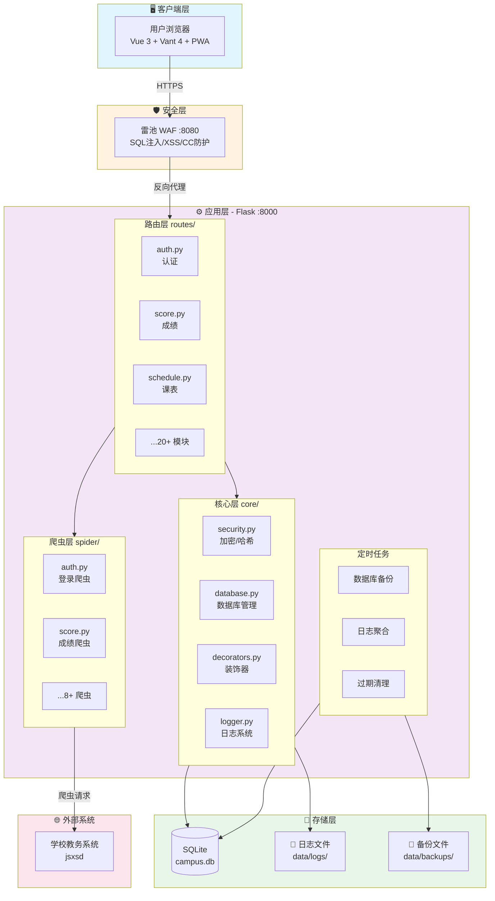
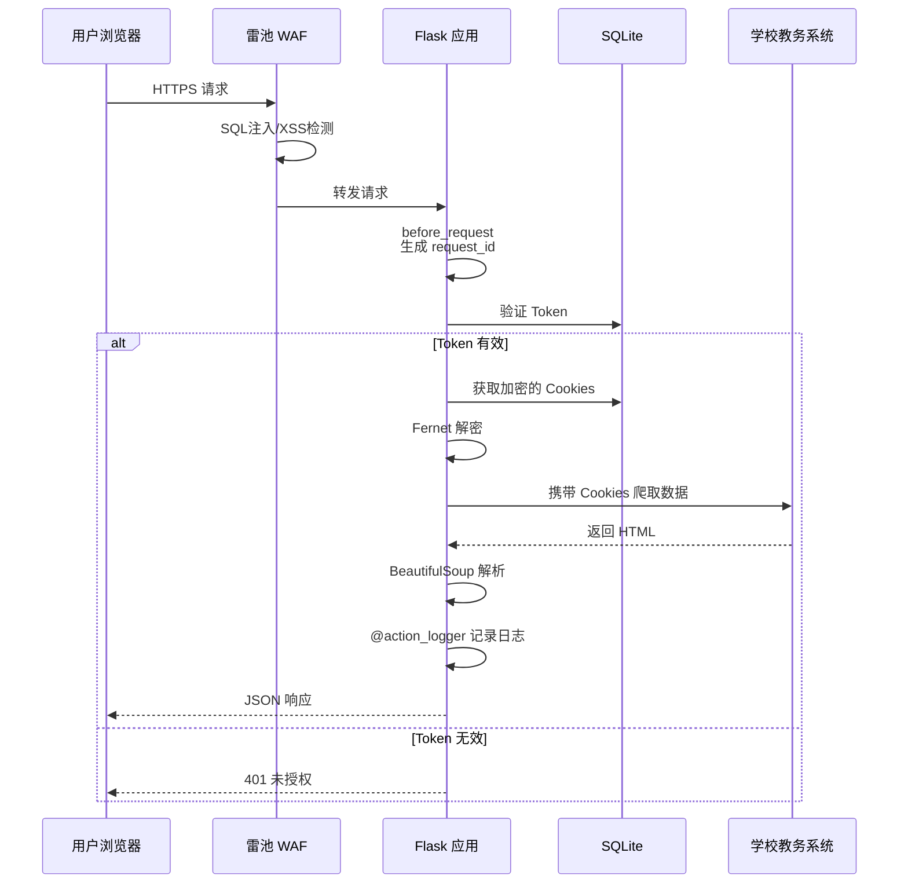
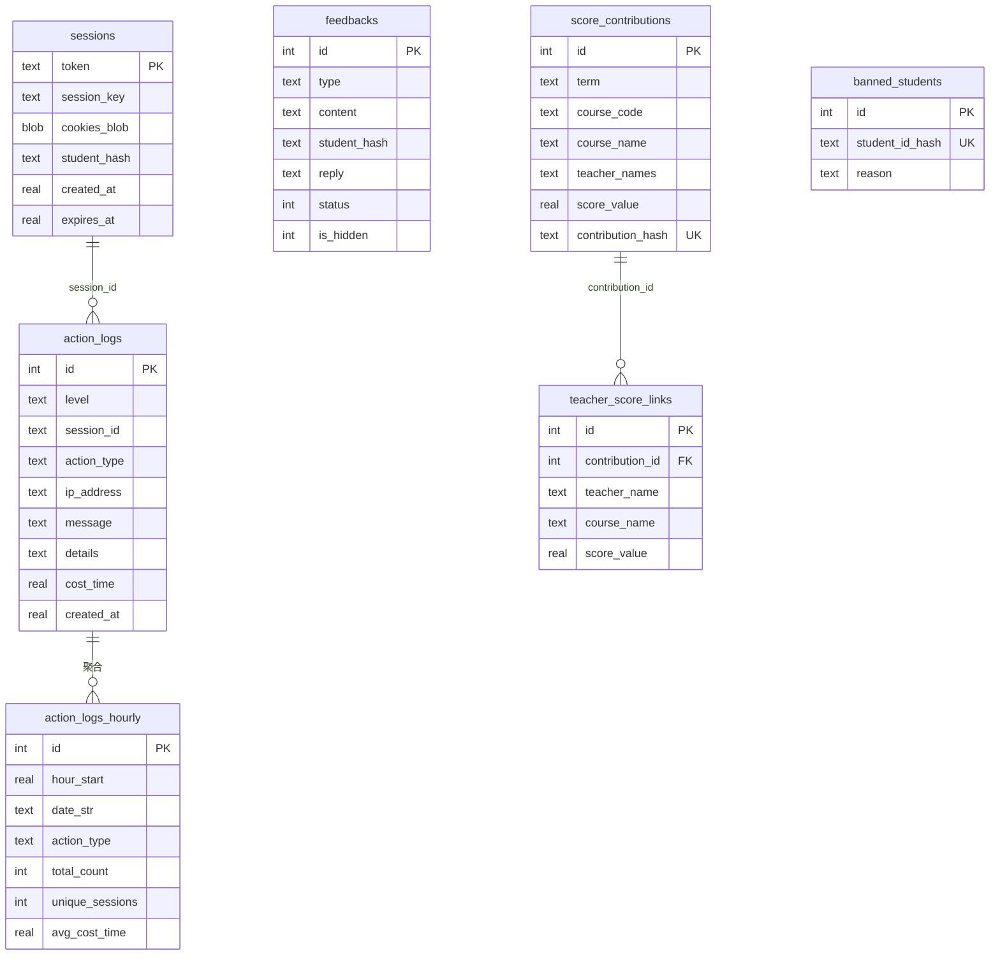
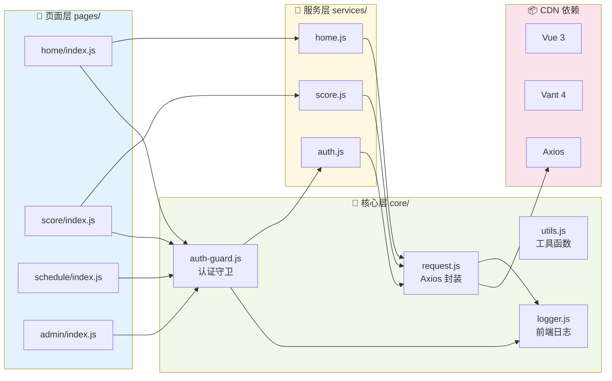
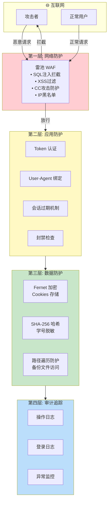

# 曲奇教务 - 第三方教务查询系统

> 一个安全、模块化、社区驱动的教务系统中间件服务

---

## 项目概述

**曲奇教务**是一个面向高校学生的第三方教务查询系统，通过爬虫技术对接学校官方教务系统，为学生提供更便捷、更友好的教务信息查询体验。项目采用前后端分离架构，具备完善的安全机制、日志审计系统和社区互动功能。

### 核心数据

| 指标     | 数据    |
| -------- | ------- |
| 代码行数 | 15,000+ |
| 功能模块 | 20+     |
| API 接口 | 50+     |
| 数据库表 | 15+     |

---

## 技术栈

### 后端技术

| 技术                      | 用途            |
| ------------------------- | --------------- |
| **Python 3.12**           | 主开发语言      |
| **Flask**                 | Web 框架        |
| **SQLite**                | 轻量级数据库    |
| **Gunicorn**              | WSGI 服务器     |
| **APScheduler**           | 定时任务调度    |
| **Loguru**                | 结构化日志      |
| **Requests**              | HTTP 客户端     |
| **BeautifulSoup4**        | HTML 解析       |
| **ddddocr**               | 验证码 OCR 识别 |
| **Cryptography (Fernet)** | 对称加密        |

### 前端技术

| 技术                | 用途                     |
| ------------------- | ------------------------ |
| **原生 ES Modules** | 模块化方案（无构建工具） |
| **Vue 3**           | 响应式 UI 框架           |
| **Vant 4**          | 移动端 UI 组件库         |
| **Axios**           | HTTP 请求库              |
| **PWA**             | 渐进式 Web 应用          |

### 运维与安全

| 技术          | 用途            |
| ------------- | --------------- |
| **雷池 WAF**  | Web 应用防火墙  |
| **SakuraFrp** | 内网穿透        |
| **uv**        | Python 包管理器 |

---

## 系统架构

### 整体架构图



### 请求处理流程



### 数据库 ER 图



### 前端模块依赖图



### 安全架构图



### 定时任务调度图

```mermaid
gantt
    title 每日定时任务调度
    dateFormat HH:mm
    axisFormat %H:%M

    section 日志任务
    日志聚合 (每小时:05)     :crit, 00:05, 5m
    日志聚合 (每小时:05)     :crit, 01:05, 5m
    日志聚合 (每小时:05)     :crit, 02:05, 5m
    日志清理 (凌晨3点)       :active, 03:00, 10m

    section 数据同步
    QQ群列表同步 (每10分钟)  :done, 00:00, 10m
    QQ群列表同步 (每10分钟)  :done, 00:10, 10m
    QQ群列表同步 (每10分钟)  :done, 00:20, 10m

    section 备份任务
    数据库备份 (可配置时间)  :milestone, 04:00, 0m
```



---

## 技术亮点

### 1. 原生 ES Modules 前端架构（零构建工具）

**亮点**: 完全抛弃 Webpack/Vite 等构建工具，采用浏览器原生 ES Modules 实现模块化。

```javascript
// 直接在浏览器中使用 ES Modules
import { createApp, ref, onMounted } from "vue";
import { authService } from "../../services/auth.js";
import { checkLogin } from "../../core/auth-guard.js";

const app = createApp({
  delimiters: ["{[", "]}"], // 避免与 Jinja2 冲突
  setup() {
    const userInfo = ref(null);
    onMounted(async () => {
      const isLoggedIn = await checkLogin();
      // ...
    });
    return { userInfo };
  },
});
```

**技术决策理由**:

- 降低项目复杂度，无需维护构建配置
- 开发即生产，所见即所得
- 利用 HTTP/2 多路复用，模块并行加载
- 浏览器原生缓存策略，无需 hash 文件名

**挑战与解决方案**:

- **Jinja2 与 Vue 语法冲突**: 自定义 Vue 分隔符 `{[ ]}` 替代 `{{ }}`
- **CDN 依赖管理**: 通过 `base.html` 统一引入，配合 JS 拦截检测机制

---

### 2. 会话安全架构（独立密钥 + 加密存储）

**亮点**: 每个用户会话使用独立的 Fernet 密钥，敏感数据（教务系统 Cookies）加密存储。

```python
# core/security.py
class SecurityManager:
    @staticmethod
    def generate_session_key() -> str:
        """为每个会话生成独立的 Fernet 密钥"""
        return Fernet.generate_key().decode()

    @classmethod
    def encrypt(cls, data: bytes, session_key: str) -> bytes:
        """使用会话专属密钥加密"""
        return cls._get_fernet(session_key).encrypt(data)
```

```python
# routes/auth.py - 登录流程
session_key = SecurityManager.generate_session_key()
session_data = {"cookies": cookies, "user_agent": user_agent}
cookies_blob = SecurityManager.encrypt(
    json.dumps(session_data).encode(), session_key
)
db.execute(
    "INSERT INTO sessions (token, session_key, cookies_blob, ...) VALUES (...)",
    (token, session_key, cookies_blob, ...)
)
```

**安全设计要点**:

- 每个会话独立密钥，单点泄露不影响其他用户
- User-Agent 绑定，防止会话劫持
- 学号哈希存储，保护用户隐私
- 滑动过期机制，活跃用户自动续期

---

### 3. 装饰器驱动的业务埋点系统

**亮点**: 通过 `@action_logger` 装饰器实现无侵入式的操作审计。

```python
# core/decorators.py
ACTION_TYPES = {
    "QUERY_SCORES": ("查询成绩", "用户查询了成绩信息"),
    "LOGIN_SUCCESS": ("登录成功", "用户登录成功"),
    "ADMIN_REPLY_FEEDBACK": ("回复反馈", "管理员回复了用户反馈"),
    # ... 80+ 操作类型
}

def action_logger(action_type):
    def decorator(func):
        @wraps(func)
        def wrapper(*args, **kwargs):
            start_time = time.time()
            try:
                return func(*args, **kwargs)
            finally:
                cost = time.time() - start_time
                sys_logger.bind(
                    session_id=token,
                    action_type=action_type,
                    ip_address=ip,
                    cost_time=cost,
                ).info(get_action_message(action_type))
        return wrapper
    return decorator
```

```python
# 使用示例 - routes/score.py
@score_bp.route('/list', methods=['GET'])
@action_logger('QUERY_SCORES')  # 一行代码完成埋点
def get_scores():
    # 业务逻辑...
```

**设计优势**:

- 业务代码零侵入
- 统一的操作类型配置，便于维护
- 自动记录耗时、IP、会话等上下文

---

### 4. 三层日志架构（控制台 + 文件 + 数据库）

**亮点**: 基于 Loguru 构建的多目标日志系统，支持实时监控和历史分析。

```python
# core/logger.py
def configure_logging():
    # 1. 控制台 - 彩色格式，开发调试
    logger.add(sys.stderr, format=console_format, colorize=True)

    # 2. 文件日志 - 按天滚动，保留30天
    logger.add(
        LOG_DIR / "campus_{time:YYYY-MM-DD}.log",
        rotation="00:00",
        retention="30 days",
    )

    # 3. 数据库 - 支持查询分析
    logger.add(sqlite_sink, level="INFO")
```

**日志聚合机制**:

```python
# core/log_aggregator.py
def aggregate_hourly_logs():
    """每小时聚合原始日志到统计表"""
    rows = db.fetch_all("""
        SELECT action_type,
               COUNT(*) as total_count,
               COUNT(DISTINCT session_id) as unique_sessions,
               AVG(cost_time) as avg_cost_time
        FROM action_logs
        WHERE created_at >= ? AND created_at < ?
        GROUP BY action_type
    """)
```

---

### 5. 高级账号会话管理（单例 + 自动重登）

**亮点**: 内置高级权限账号，用于公共数据查询，支持会话过期自动重登。

```python
# core/advanced_session.py
class AdvancedSessionManager:
    """高级账号会话管理器（单例模式）"""
    _instance = None
    _lock = threading.Lock()

    def request_with_auto_relogin(self, method, url, max_retries=1, **kwargs):
        """发送请求，检测到过期自动重登并重试"""
        for attempt in range(max_retries + 1):
            response = self._session.get(url, **kwargs)
            if is_login_expired(response.text):
                if attempt < max_retries:
                    self.refresh_session()  # 自动重登
                    continue
            return True, response
```

**应用场景**:

- 空教室查询（无需用户登录）
- 预选课程搜索
- 当前学期/周次获取

---

### 6. 社区驱动的平均分系统

**亮点**: 创新的"贡献-查看"机制，用户贡献成绩后才能查看平均分。

```python
# routes/teacher_score.py
@teacher_score_bp.route("/sync", methods=["POST"])
def sync_scores():
    """一键同步成绩（首次全量 + 后续增量）"""
    # 1. 获取用户所有成绩
    scores_data = score_spider.get_scores(cookies)

    # 2. 关联教师信息（从选课结果获取）
    for term in terms:
        course_data = course_spider.get_course_selection(cookies, term)
        teacher_map[key] = course.get("teacher", "")

    # 3. 去重存储（基于 user_hash + course_code + term）
    contribution_hash = generate_contribution_hash(user_hash, course_code, term)
    if not is_already_contributed(contribution_hash):
        save_contribution(score_data, user_hash)

    # 4. 更新用户贡献状态
    update_contribution_status(user_hash, synced_count)
```

**隐私保护设计**:

- 最低样本量阈值（5 人），防止反推个人成绩
- 用户标识使用哈希，无法关联真实学号
- 只存储成绩数值，不存储个人信息

---

### 7. 前端认证守卫系统

**亮点**: 统一的登录状态管理，支持自动登录、静默检查、研究生账号检测。

```javascript
// static/js/core/auth-guard.js
export const checkLogin = async (options = {}) => {
  const token = localStorage.getItem("token");
  if (!token) {
    // 尝试自动登录（使用缓存的账号密码）
    if (opts.autoLogin) {
      const success = await tryAutoLogin();
      if (success) return true;
    }
    // 跳转登录页
    if (opts.redirect) {
      setTimeout(
        () => (window.location.href = opts.redirectUrl),
        opts.redirectDelay
      );
    }
    return false;
  }

  // 验证 Token 有效性
  const res = await authService.getUserInfo();
  if (res.code !== 200) {
    // Token 失效，尝试自动登录
    if (opts.autoLogin) {
      const success = await tryAutoLogin();
      if (success) return true;
    }
    handleLogout(opts);
    return false;
  }

  // 检测研究生账号（学号第5位不是4）
  if (opts.checkGraduate && isGraduateAccount()) {
    showGraduateWarning();
  }

  return true;
};
```

**使用方式**:

```javascript
// 需要登录的页面
onMounted(async () => {
  const isLoggedIn = await checkLogin();
  if (!isLoggedIn) return;
  await loadUserData();
});

// 静默检查（不跳转）
const isLoggedIn = await silentCheckLogin();
```

---

### 8. 数据库自动迁移机制

**亮点**: 启动时自动检测并执行数据库结构迁移，无需手动维护版本。

```python
# core/database.py
def _migrate(self):
    """数据库迁移：为现有表添加新字段"""
    with sqlite3.connect(self.db_name) as conn:
        # 检查字段是否存在
        cursor = conn.execute("PRAGMA table_info(sessions)")
        columns = [row[1] for row in cursor.fetchall()]

        if "session_key" not in columns:
            print("【DB】迁移: 为 sessions 表添加 session_key 字段...")
            conn.execute("ALTER TABLE sessions ADD COLUMN session_key TEXT")
            # 旧会话没有独立密钥，清除让用户重新登录
            conn.execute("DELETE FROM sessions WHERE session_key IS NULL")
```

---

### 9. 定时任务调度系统

**亮点**: 基于 APScheduler 的后台任务调度，支持数据库备份、日志聚合、数据同步。

```python
# core/backup.py
def init_backup_scheduler():
    scheduler = BackgroundScheduler()

    # 每日定时备份（可配置时间）
    scheduler.add_job(
        backup_database,
        CronTrigger(hour=hour, minute=minute),
        id="daily_backup"
    )

    # 每小时日志聚合
    scheduler.add_job(
        run_log_aggregation,
        CronTrigger(minute=5),
        id="hourly_log_aggregation"
    )

    # 每日日志清理（保留7天）
    scheduler.add_job(
        run_log_cleanup,
        CronTrigger(hour=3, minute=0),
        id="daily_log_cleanup"
    )

    scheduler.start()
```

---

### 10. 广告拦截检测机制

**亮点**: 检测浏览器插件对核心资源的拦截，提供友好的用户引导。

```javascript
// templates/base.html
window.addEventListener("DOMContentLoaded", function () {
  // 检测核心依赖
  var blocked = [];
  if (typeof Vue === "undefined") blocked.push("Vue");
  if (typeof vant === "undefined") blocked.push("Vant");
  if (typeof axios === "undefined") blocked.push("Axios");

  if (blocked.length > 0) {
    showBlockedWarning(
      "检测到以下核心资源被浏览器插件拦截：" + blocked.join(", ")
    );
    return;
  }

  // 延时检测页面模块是否加载成功
  setTimeout(function () {
    if (!window.__APP_LOADED__) {
      showBlockedWarning("检测到页面脚本被浏览器插件拦截");
    }
  }, 1000);
});
```

---

## 功能模块

### 教务查询

| 模块     | 功能描述                 |
| -------- | ------------------------ |
| 课程表   | 周视图课表，支持日期切换 |
| 成绩查询 | 多学期成绩，GPA 计算     |
| 考试安排 | 考试时间、地点查询       |
| 选课结果 | 已选课程列表             |
| 空教室   | 按时间段查询空闲教室     |
| 教室闲忙 | 指定教室的课表           |
| 培养方案 | 专业培养计划             |
| 预选课   | 课程搜索与筛选           |

### 社区功能

| 模块       | 功能描述                 |
| ---------- | ------------------------ |
| 选课推荐   | 用户提交课程推荐         |
| 平均分查询 | 教师课程平均分（贡献制） |
| 意见反馈   | 用户反馈与管理员回复     |
| 评论系统   | 更新日志评论             |
| 表态系统   | 点赞/踩功能              |

### 系统功能

| 模块     | 功能描述            |
| -------- | ------------------- |
| 数据大屏 | 实时访问统计        |
| 更新日志 | 版本更新记录        |
| 后台管理 | 管理员功能面板      |
| 数据备份 | 自动/手动备份与恢复 |

---

## 安全设计

### 多层防护架构

```
用户请求 → 雷池WAF(SQL注入/XSS/CC防护) → Flask(业务鉴权) → 数据库
```

### 安全措施清单

| 层级   | 措施                                  |
| ------ | ------------------------------------- |
| 网络层 | WAF 防护、IP 黑名单、CC 攻击防护      |
| 传输层 | HTTPS 加密、X-Forwarded-For 解析      |
| 应用层 | Token 认证、User-Agent 绑定、会话过期 |
| 数据层 | Fernet 加密、学号哈希、路径遍历防护   |
| 审计层 | 操作日志、登录日志、异常监控          |

### 敏感数据处理

```python
# 学号哈希（不可逆）
def hash_student_id(student_id: str) -> str:
    salt = Config.BAN_SALT
    data = f"{salt}:{student_id}".encode()
    return hashlib.sha256(data).hexdigest()

# 封禁检查（基于哈希比对）
def is_student_banned(student_id: str) -> tuple[bool, str | None]:
    student_hash = hash_student_id(student_id)
    row = db.fetch_one(
        "SELECT reason FROM banned_students WHERE student_id_hash = ?",
        (student_hash,)
    )
    return (True, row.get("reason")) if row else (False, None)
```

---

## 项目结构

```
easy-qfnu-flask/
├── core/                    # 核心模块
│   ├── app.py              # Flask 应用工厂
│   ├── database.py         # 数据库管理器 + 自动迁移
│   ├── decorators.py       # 装饰器（权限、日志）
│   ├── security.py         # 安全模块（加密、哈希）
│   ├── logger.py           # 日志配置
│   ├── log_aggregator.py   # 日志聚合
│   ├── backup.py           # 备份调度
│   ├── advanced_session.py # 高级账号会话
│   └── response.py         # 统一响应格式
├── routes/                  # 路由蓝图
│   ├── auth.py             # 认证
│   ├── score.py            # 成绩
│   ├── schedule.py         # 课表
│   ├── teacher_score.py    # 平均分
│   └── ...                 # 其他模块
├── spider/                  # 爬虫模块
│   ├── auth.py             # 登录爬虫
│   ├── score.py            # 成绩爬虫
│   └── ...                 # 其他爬虫
├── static/                  # 静态资源
│   ├── js/
│   │   ├── core/           # 核心模块
│   │   │   ├── request.js  # Axios 封装
│   │   │   └── auth-guard.js # 认证守卫
│   │   ├── services/       # API 服务层
│   │   └── pages/          # 页面逻辑
│   └── css/                # 样式文件
├── templates/               # Jinja2 模板
│   └── base.html           # 基础模板
└── data/                    # 数据目录
    ├── campus.db           # SQLite 数据库
    ├── logs/               # 日志文件
    └── backups/            # 备份文件
```

---

## 开发与部署

### 本地开发

```bash
# 安装依赖
uv sync --frozen

# 启动开发服务器
uv run python main.py
```

### 生产部署

```bash
# 使用 Gunicorn 启动
uv run gunicorn -w 4 -b 127.0.0.1:8000 app:app

# 配合 WAF 反向代理
# 雷池 WAF 监听 8080，转发到 8000
```

---

## 项目亮点总结

1. **零构建前端架构** - 原生 ES Modules，降低复杂度
2. **独立密钥会话安全** - 每用户独立加密，防止批量泄露
3. **装饰器埋点系统** - 无侵入式操作审计
4. **三层日志架构** - 控制台 + 文件 + 数据库
5. **自动重登机制** - 高级账号会话自动维护
6. **社区驱动数据** - 贡献制平均分系统
7. **自动数据库迁移** - 启动时自动升级表结构
8. **定时任务调度** - 备份、聚合、清理自动化
9. **多层安全防护** - WAF + 应用层 + 数据层
10. **广告拦截检测** - 友好的用户引导

---

## 联系方式

- **作者**: W1ndys
- **项目**: 曲奇教务
- **技术栈**: Python Flask + Vue 3 + SQLite

---

_本文档用于项目展示，代码仓库为私有仓库。_
